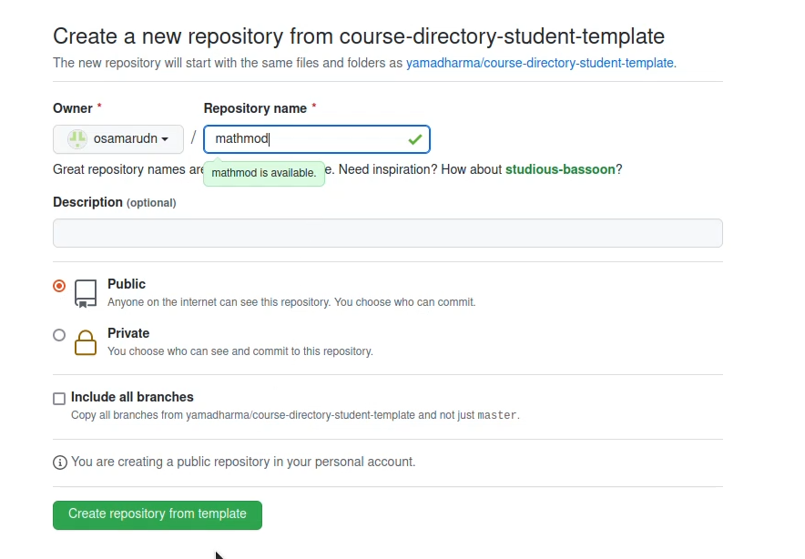
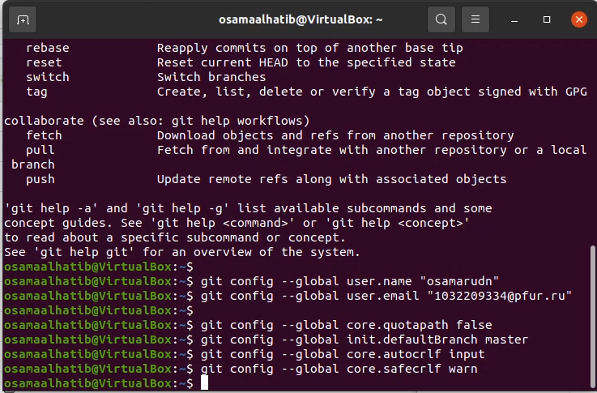
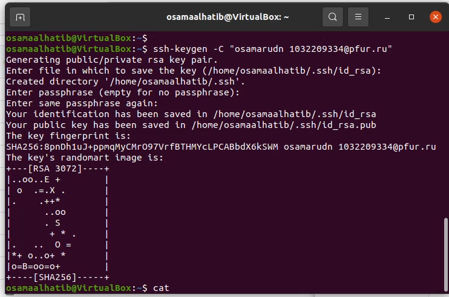
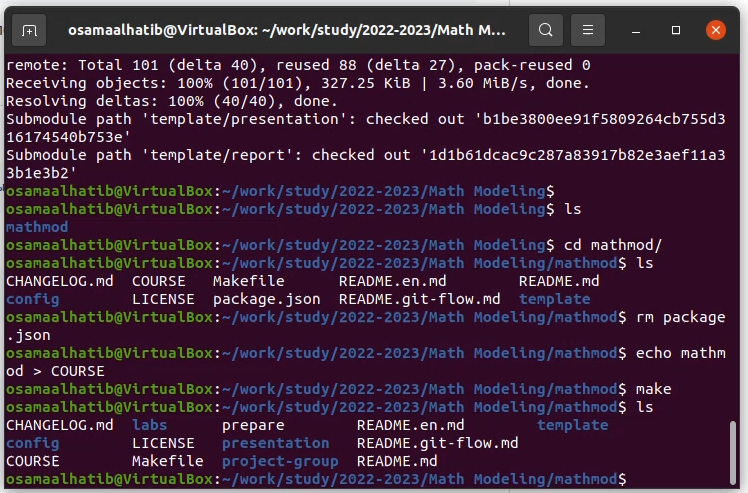
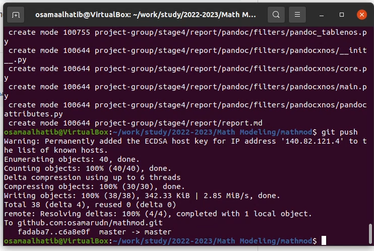

---
## Front matter
lang: ru-RU
title: Лабораторная работа 1
author: Алхатиб Осама	НПИбд-02-20
institute: Российский Университет Дружбы Народов
date: 10 февраля, 2023, Москва, Россия

## Formatting
mainfont: PT Serif
romanfont: PT Serif
sansfont: PT Sans
monofont: PT Mono
toc: false
slide_level: 2
theme: metropolis
header-includes: 
 - \metroset{progressbar=frametitle,sectionpage=progressbar,numbering=fraction}
 - '\makeatletter'
 - '\beamer@ignorenonframefalse'
 - '\makeatother'
aspectratio: 43
section-titles: true

---

# Цели и задачи работы

## Цель лабораторной работы

Целью данной работы является изучение идеологии и применения средств контроля версий.

## Задачи лабораторной работы

1. Создать учетную запись на github.com

2. Настроить репозиторий

# Процесс выполнения лабораторной работы

## Системы контроля версий

Git — это система контроля версий (VCS), которая позволяет отслеживать и фиксировать изменения в коде: 
вы можете восстановить код в случае сбоя или откатить до более ранних версий.

Команды Git принимают вид git команда аргументы, где аргументом может быть путь к файлу. 

## Создаем учетную запись на github.com и репозиторий

{ #fig:001 width=70% height=70% }

## Задаем конфигурацию

{ #fig:002 width=70% height=70% }

## Генерируем SSH-ключ

{ #fig:003 width=70% height=70% }

## Создание репозитория из шаблона

{ #fig:005 width=70% height=70% }

## Оформленный репозиторий.

{ #fig:006 width=70% height=70% }

# Выводы по проделанной работе

## Вывод

Мы приобрели практические навыки работы с системой контроля версий git и создали свой репозиторий.