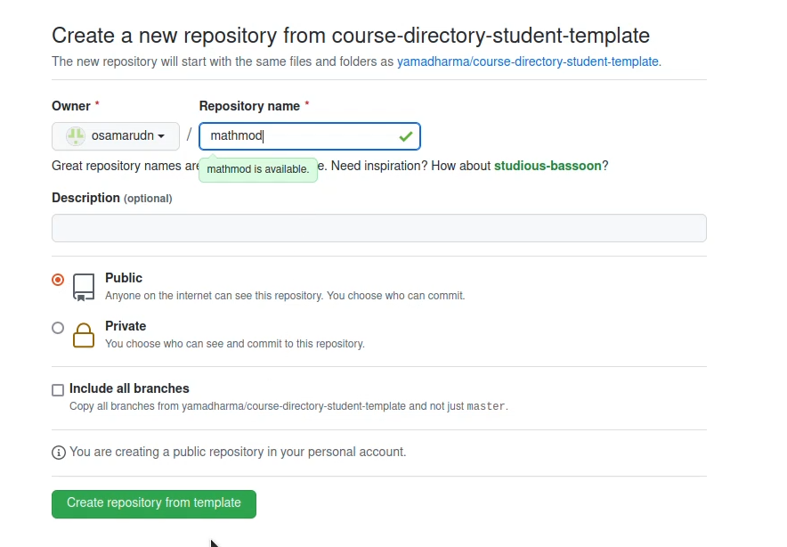
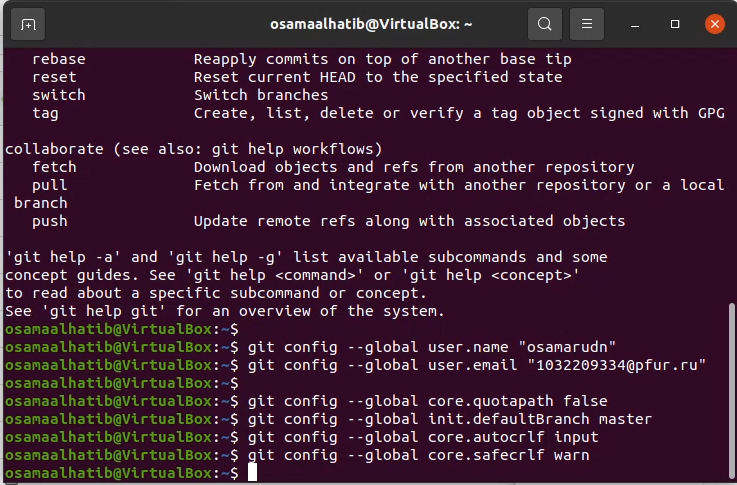
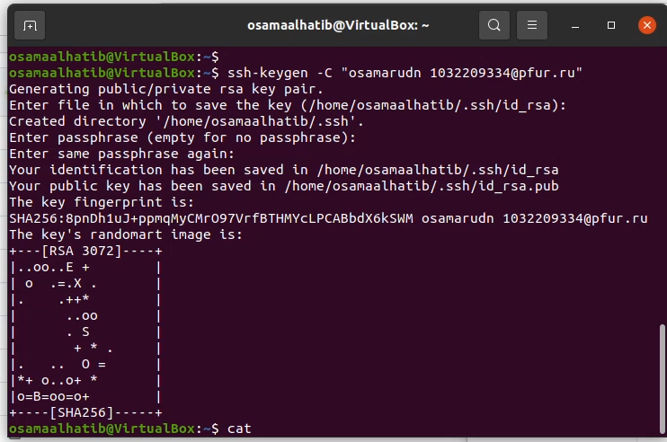
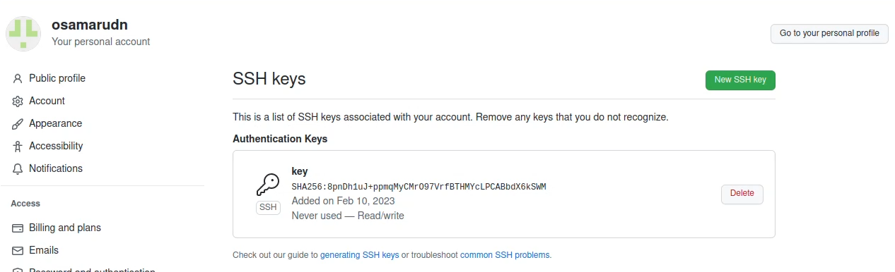
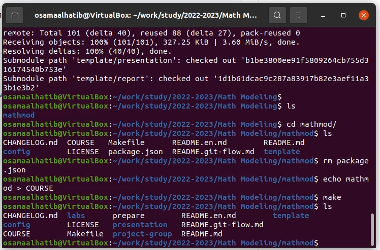
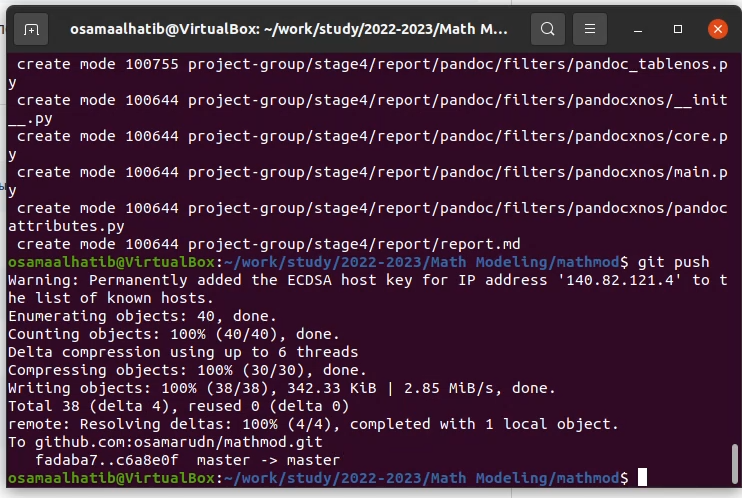
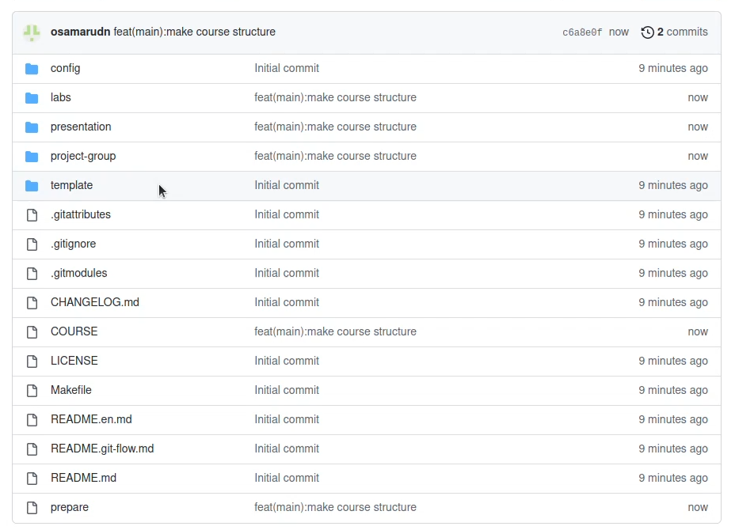

---
# Front matter
title: "Отчёт по лабораторной работе №1"
subtitle: "Система контроля версий Git"
author: "Алхатиб Осама	НПИбд-02-20"

## Generic otions
lang: ru-RU
toc-title: "Содержание"

## Bibliography
bibliography: bib/cite.bib
csl: pandoc/csl/gost-r-7-0-5-2008-numeric.csl

## Pdf output format
toc: true # Table of contents
toc-depth: 2
lof: true # List of figures
fontsize: 12pt
linestretch: 1.5
papersize: a4
documentclass: scrreprt
## I18n polyglossia
polyglossia-lang:
  name: russian
  options:
	- spelling=modern
	- babelshorthands=true
polyglossia-otherlangs:
  name: english
## I18n babel
babel-lang: russian
babel-otherlangs: english
## Fonts
mainfont: PT Serif
romanfont: PT Serif
sansfont: PT Sans
monofont: PT Mono
mainfontoptions: Ligatures=TeX
romanfontoptions: Ligatures=TeX
sansfontoptions: Ligatures=TeX,Scale=MatchLowercase
monofontoptions: Scale=MatchLowercase,Scale=0.9
## Biblatex
biblatex: true
biblio-style: "gost-numeric"
biblatexoptions:
  - parentracker=true
  - backend=biber
  - hyperref=auto
  - language=auto
  - autolang=other*
  - citestyle=gost-numeric
## Pandoc-crossref LaTeX customization
figureTitle: "Рис."
tableTitle: "Таблица"
listingTitle: "Листинг"
lofTitle: "Список иллюстраций"
lotTitle: "Список таблиц"
lolTitle: "Листинги"
## Misc options
indent: true
header-includes:
  - \usepackage{indentfirst}
  - \usepackage{float} # keep figures where there are in the text
  - \floatplacement{figure}{H} # keep figures where there are in the text
---

# Цель работы

Целью данной работы является изучение идеологии и применения средств контроля версий.

# Теоретическая часть

Git — это набор консольных утилит, которые отслеживают и фиксируют изменения в 
файлах (чаще всего речь идет об исходном коде программ, но вы можете использовать 
его для любых файлов на ваш вкус). Изначально Git был создан Линусом Торвальдсом 
при разработке ядра Linux. Однако инструмент так понравился разработчикам, 
что в последствии, он получил широкое распространение и его стали использовать 
в других проектах. С его помощью вы можете сравнивать, анализировать, 
редактировать, сливать изменения и возвращаться назад к последнему сохранению. 
Этот процесс называется контролем версий.

# Выполнение лабораторной работы

Создаем учетную запись на github.com и репозиторий на основе шаблона преподавателя.(рис. [-@fig:001])

{ #fig:001 width=70% height=70% }

Задаем конфигурацию пользователя и генерируем SSH-ключ(рис. [-@fig:002], [-@fig:003])

{ #fig:002 width=70% height=70% }

{ #fig:003 width=70% height=70% }

{ #fig:004 width=70% height=70% }

Скопировали репозиторий в папку.(рис. [-@fig:005])

{ #fig:005 width=70% height=70% }

Оформили курс по данному шаблону и загрузили в репозиторий.(рис. [-@fig:006], [-@fig:007])

{ #fig:006 width=70% height=70% }

{ #fig:007 width=70% height=70% }

# Вывод

Мы приобрели практические навыки работы с системой контроля версий git и создали свой репозиторий

# Список литературы {.unnumbered}

1. [Git для новичков](https://habr.com/ru/post/541258/)
2. [Основы Git](https://habr.com/ru/post/583478/)
3. [Руководство по оформлению Markdown файлов](https://gist.github.com/Jekins/2bf2d0638163f1294637)